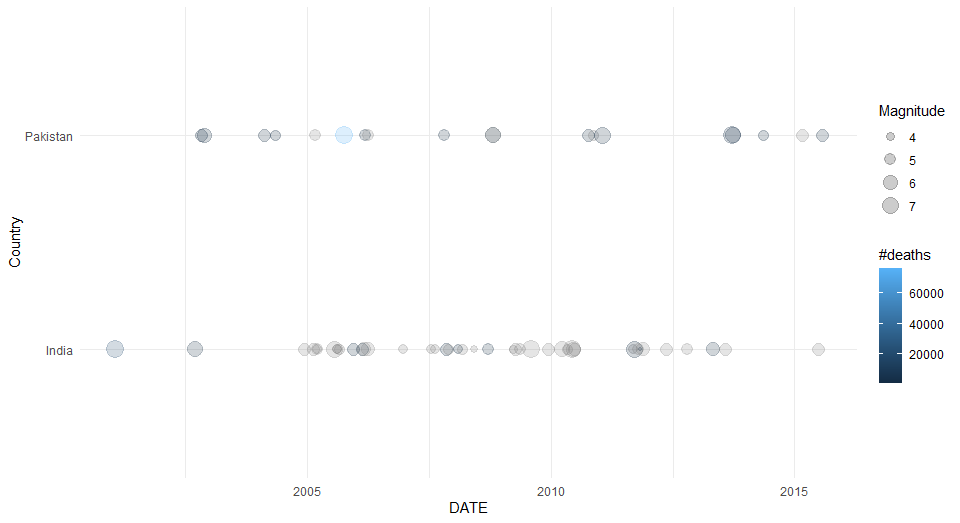
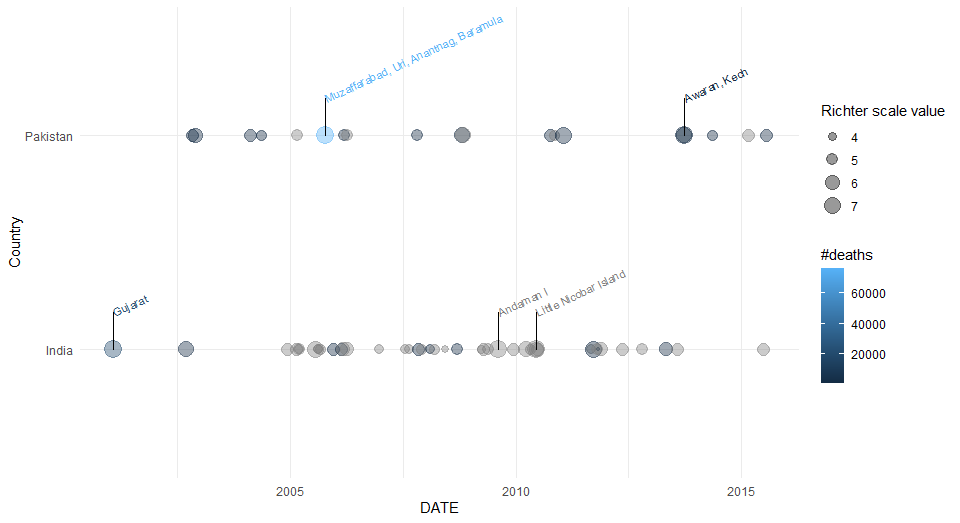
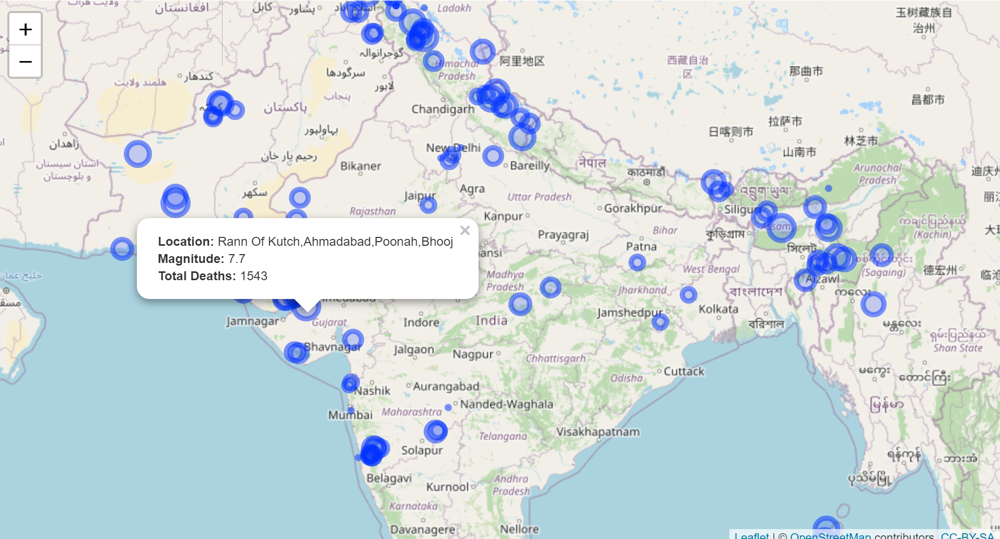

<!-- README.md is generated from README.Rmd. Please edit that file -->

```{r, include = FALSE}
knitr::opts_chunk$set(
  collapse = TRUE,
  comment = "#>",
  fig.path = "man/figures/README-",
  out.width = "100%"
)
```

# noaaquake

<!-- badges: start -->
[](https://travis-ci.com/adeel1997/noaaquake)
<!-- badges: end -->

The goal of noaaquake is to clean and visualize raw NOAA earthquake data

## Installation

You can install the released version of noaaquake from [CRAN](https://CRAN.R-project.org) with:

``` r
install.packages("noaaquake")
```

And the development version from [GitHub](https://github.com/) with:

``` r
# install.packages("devtools")
devtools::install_github("adeel1997/noaaquake")
```

## Gathering the cleaned data

The raw earthquake data downloaded from [NOAA website](https://www.ngdc.noaa.gov/nndc/struts/form?t=101650&s=1&d=1) 
The raw data can be loaded into a dataframe with the data() function:

```
NOAA_data <- load("data/NOAA_data.rda")
```

Once we retrieve this raw data we process and clean it using the eq_clean_data():

```
# Load and clean the data
data_clean <- NOAA_data %>% eq_clean_data()
```

## The use of Geom timeline

There are two geoms, the first of which (geom_timeline) looks to chart a timeline of earthquakes for a given country / countries
with points representing earthquake events, point size indicating
earthquake magnitude and colour representing number of deaths. x (the date) is a required aesthetic whereas y (country) is optional.

```
 data(NOAA_data)
 NOAA_data %>% eq_clean_data() %>%
 dplyr::filter(Country %in% c("India", "Pakistan")) %>%
    ggplot(aes(x = date, y = Country, color = Total.Deaths, size = Mag,
               magnitude = Mag, label =Location_Name)) +
    labs(color="#deaths",size="Magnitude",x="DATE")+
    geom_timeline(alpha=0.2,xmin = ymd('2000-01-01'), xmax = ymd('2015-12-31'))+
   labs(x="DATE")+theme_minimal()
```

This will produce the chart:



The second geom is called geom_timeline_label, looks to build on geom_timeline by adding
labeled annotations. This adds verticallines and location labels will be added to the top
n_max (default = 5) earthquakes by magnitude.

```
labels <- NOAA_data %>% eq_clean_data() %>%
 dplyr::filter(Country %in% c("India", "Pakistan"))%>%
    filter(date> ymd('2000-01-01') & date <ymd('2015-12-31'))%>%
   top_n(5,Mag)

NOAA_data %>% eq_clean_data() %>%
    dplyr::filter(Country %in% c("Pakistan", "India")) %>%
    ggplot(aes(x = date, y = Country, color = Total.Deaths, size = Mag,
               magnitude = Mag, label =Location_Name)) +
    geom_timeline(alpha=0.4,xmin = ymd('2000-01-01'), xmax = ymd('2015-12-31'))+
    geom_timeline_label(data = labels,
                        mapping = aes(x = date, y = Country, label = Location_Name))+
    labs(color="#deaths",size="Richter scale value",x="DATE")+
    theme_minimal()
```

The resulting chart looks as follows :



## Interactive map to visualize the earthquake

The mapping functions require the leaflet package to run and will chart
a subset of earthquake events on a map. In the example we take
earthquakes from India and Pakistan for years >= 2000.To see this we use the eq_map() function that requires a
dataframe and annot_col (short for annotation column) as input. This returns a leaflet map 
```
data_clean <- NOAA_data %>%
 eq_clean_data() %>%
 dplyr::filter(Country == "India"|Country == "Pakistan" & lubridate::year(date) >= 2000)
 eq_map(data = data_clean, annot_col = "Mag")
```
This produces a dynamic map which you can visualize in the viewer tab of R studio or in the broswer. The static image looks as follows :

